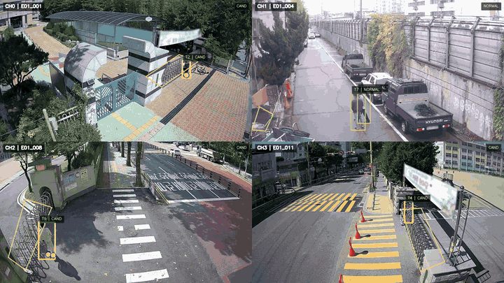

# AID -- Area Intrusion Detection for CCTV with Boundary-Aware Continuity

A service-oriented proof of concept for event-level CCTV area intrusion detection.  
The system determines whether a person has entered a defined ROI (for example, a fenced perimeter) and is designed to produce stable, confirmed intrusion events rather than per-frame bounding-box alerts.

The main challenge is not person detection by itself, but maintaining reliable intrusion judgment when a person is only partially visible or temporarily lost near the ROI boundary.

ROI definitions, private run artifacts, and dataset-derived intermediate files are intentionally omitted from the public repository.

## Why this is difficult

A naive intrusion rule asks only whether a detected person box overlaps the ROI.
That is easy to implement, but it produces many false positives near boundaries.

A stricter rule based on ankle or lower-body evidence is more meaningful for real entry, but it becomes harder to apply during boundary crossing.
When a person climbs over a wall or fence, the most reliable confirmation cue can temporarily disappear because of occlusion, pose change, or short detector dropout.

The challenge, then, is not just detecting a person. It is preserving a precise intrusion definition while handling the short ambiguous interval where ankle evidence is temporarily unavailable.

- **False positives from naive ROI overlap**: simple bbox overlap near the boundary can trigger intrusion even when actual entry is not yet clear.
- **Boundary crossing with missing ankle evidence**: during wall- or fence-crossing, the lower body may be partially hidden, ankle evidence can disappear, and the detector may briefly lose the actor exactly when confirmation is most needed.
- **Cost of always-on fine-grained confirmation**: one way to recover missing ankle evidence is to run heavier pose or part-level models continuously, but that is expensive for multi-stream CCTV monitoring and hard to justify as the default path for every frame.

So the design goal was to preserve an ankle-centered intrusion definition without paying the cost of always-on heavy recovery models.

## What I built

### Architecture

The pipeline runs on NVIDIA DeepStream (GStreamer-based, GPU-accelerated) and processes four camera streams simultaneously:

<p align="center">
  
</p>

```
4 RTSP/file sources
  --> person detection and tracking
  --> boundary-aware occlusion handling
  --> event-level intrusion decision
  --> output artifacts (events, summaries, overlay video)
```

### Key design decisions

**Intrusion as a state machine, not a threshold.**
Each tracked person runs through a three-state FSM: `OUT` -> `CANDIDATE` -> `IN_CONFIRMED`. Transitions require sustained evidence over multiple frames, with separate entry and exit counters and a grace period. This reduces single-frame false positives.

**Confirmation is anchored in lower-body evidence.**
The system is designed to rely primarily on lower-body evidence when confirming intrusion, with ankle position treated as the strongest cue for actual entry into the ROI. Upper-body-only evidence may still be useful during ambiguous boundary intervals, but it is not the preferred basis for final confirmation.

**KLT continuity is used as a bridge across short boundary gaps.**
When the detector loses a person near the ROI boundary, KLT optical flow helps carry forward approximate geometry through the short ambiguous interval. This continuity layer is intended to preserve event context and support later recovery, rather than replace the main lower-body-based confirmation logic.

## Pipeline stages

| Stage | Purpose | Key output |
|-------|---------|------------|
| 00 | Data prep: clip extraction, ROI labeling | Clip and metadata preparation tools |
| 01 | Baseline YOLO + ByteTrack tracking | Single-clip tracked video |
| 02 | KLT and pose-patch continuity experiments | Continuity-augmented sidecars |
| 03 | DeepStream single-stream proving stage | Single-stream intrusion events |
| **04** | **Multistream DeepStream pipeline (final)** | **4-source intrusion events + tiled video** |

Stage 03 is the preserved single-stream proving stage. It was also the main DeepStream integration stage for custom GStreamer plugins used to test continuity-related behaviors and event-level intrusion logic in a controlled single-stream setting.

Stage 04 is the main multistream deliverable. It carries the pipeline through to the final four-camera intrusion flow, including boundary-aware occlusion handling and event-level decision outputs.

### Stage 04 substages

| Step | What it does |
|------|-------------|
| 04.01 | Runs the DeepStream detector + NvDCF tracker on 4 streams, exports tracking sidecars |
| 04.02 | Adds operator-facing monitoring OSD via custom GStreamer plugin |
| 04.03 | Runs the intrusion FSM decision pass, produces events and tiled overlay video |
| 04.04 | Extends 04.03 with upper-anchor continuity support for short tracking gaps |
| 04.05a | Generates per-source ROI crop clips with frame-index lockstep |
| 04.05 | Final stage: KLT-backed proxy rows, gated reacquisition, frozen-hold geometry, then FSM rerun |


### Gated reacquisition

When a person is detected again after a short gap, the system does not immediately assume that the new box belongs to the same actor. Instead, it checks whether the new detection is consistent with the recent continuity estimate, and only then decides whether to adopt it, treat it as weak support, or reject it. This helps prevent a noisy one-frame detection from jumping a confirmed intrusion state to a nearby bystander.

## Repository structure

```
aidlib/                     Core library
  intrusion/                  Intrusion detection modules
    decision_fsm.py             Event-level FSM + sidecar processing
    features.py                 Bbox-to-ROI factor computation
    roi.py                      ROI polygon geometry and caching
    score.py                    Weighted scoring
  run_utils.py                Runtime path management and logging

scripts/
  00_prep/                  Data preparation and ROI labeling tools
  01_tracking/              Baseline YOLO + ByteTrack
  02_tracking_assist/       KLT and pose-patch experiments
  03_ds_single_stream/      Single-stream DeepStream + plugins
  04_ds_multi_stream/       Multistream pipeline (main)
    04_01_* to 04_05_*        Stage 04 Python entrypoints
    gst-dsintrusionmeta/      Custom GStreamer plugin (C++)
    gst-dsmonitorosd/         Custom GStreamer plugin (C++)

configs/
  deepstream/               DeepStream pipeline and detector configs
  trackers/                 Tracker parameter configs
  intrusion/                FSM thresholds and scoring weights
  cameras/                  Per-camera stabilization parameters

```

Note: the source directories were renamed to `03_ds_single_stream` and `04_ds_multi_stream` for clarity. Historical naming may still appear in code comments, logs, or older commit history, even though private run artifacts are omitted from the public repository.

## Evidence

Representative Stage 04 runs produce the following artifacts:

- `tracking_sidecar.csv` -- per-frame, per-track rows with bbox data, continuity-related mode metadata, and other tracking/debug fields
- `intrusion_events.jsonl` -- one record per state transition with candidate metrics, confirm reason, and counters
- `intrusion_summary.json` -- per-source summary including confirmed event count, decision parameters, and sidecar statistics
- `*_tiled_boundary_reacquire.mp4` -- 2x2 tiled visualization across all 4 sources

The public repository focuses on the pipeline design, stage structure, and benchmark interpretation rather than shipping private run artifacts.

## Tech stack

- **Detection**: YOLO11s (Ultralytics), exported to ONNX/TensorRT
- **Tracking**: NvDCF (DeepStream), ByteTrack (Ultralytics, for baseline comparison)
- **Pipeline**: NVIDIA DeepStream 7.1, GStreamer
- **Continuity**: KLT optical flow (OpenCV), YOLO11s-pose for ankle keypoints
- **Plugins**: custom GStreamer elements written in C++ across the DeepStream stages
- **Decision logic**: Python FSM and scoring modules for event-level intrusion judgment
- **Infrastructure**: Docker (DeepStream NGC container), CUDA 12.8, TensorRT

## 16-channel burst benchmark

After the core Stage 04 multistream pipeline was working end-to-end on four sources, the system was stress-tested with a 16-channel synchronized intrusion burst benchmark.

This was not the primary project deliverable. It was a validation and scalability extension designed to answer a practical question: how does the full boundary-aware pipeline behave when every source is simultaneously running through the expensive confirmation path?

The benchmark used 16 synchronized 50-second clips, each containing at least one intrusion event near the ROI boundary. All sources were read at `input_read_fps=10`. Because every clip contains active boundary crossing, this forces the pipeline into its heaviest operating mode on all channels simultaneously -- the decision FSM, KLT continuity, gated reacquisition, and render-side keypoint recovery are all active on most frames across most sources.

### What the benchmark measured

The pipeline processes each run through sequential phases: DeepStream GPU inference and tracking export, KLT-based continuity augmentation, the intrusion decision pass (FSM state transitions with ankle-level pose probes), and a boundary-aware render pass with gated reacquisition. Each phase is individually timed.

Under the 16-channel burst workload, the dominant costs were:

- **Decision pass** (~33s): per-track pose probing to determine ankle position relative to the ROI boundary. This runs a YOLO pose model on every candidate track that reaches the `rich_pose` classification tier.
- **Render with boundary reacquire** (~32s): keypoint refresh and missing-track recovery using gated model calls, plus source video I/O and overlay composition.
- **KLT continuity augmentation** (~21s): optical flow bridging across short detector gaps, gated by a per-frame boundary-relevance predicate.

The benchmark also tracked per-frame tail latency, model invocation counts, and guardrail counters for each optimization variant.

### Benchmark results

The baseline configuration (with render-side cadence optimizations enabled, all decision-side experimental flags off) processed 16 channels at approximately **4.9 fps per stream** with 17 confirmed intrusion events.

With a decision-pass lazy decode optimization enabled (skipping full frame decode on frames where no track requires a pose probe), throughput increased to approximately **5.4 fps per stream** while producing the same 17 confirmed events, with zero guardrail warnings and zero lazy-decode misses across 6,644 skipped frames.

A render-side model budget cap was also tested. While it achieved similar throughput and reduced tail latency, it was excluded from the headline result because the budget was set too aggressively and starved confirmed-state tracks of keypoint refresh -- a guardrail violation that, while not affecting event counts in this run, would not be acceptable in production.

## Further technical details

- `docs/stage03/README.md` -- Stage 03 single-stream semantics: the continuity-vs-truth problem, why event-level intrusion is harder than per-frame detection, and how the FSM confirmation logic was developed in a controlled single-stream setting before being carried to multistream.
- `docs/stage04/README.md` -- Stage 04 multistream architecture and the 16-channel benchmark: pipeline structure, runner/core separation, bottleneck interpretation, and how to read the benchmark results.

## Data source and attribution

- Some demo visuals in this portfolio were generated from AI-Hub data.
- Dataset: "지능형 관제 서비스 CCTV 영상 데이터" (AI-Hub)
- Source: https://www.aihub.or.kr/aihubdata/data/view.do?currMenu=115&topMenu=100&dataSetSn=71850
- Used for non-commercial research/development and portfolio demonstration.
- Third-party datasets remain under their respective terms.

## License

This repository is shared as a personal portfolio project. All rights reserved.
